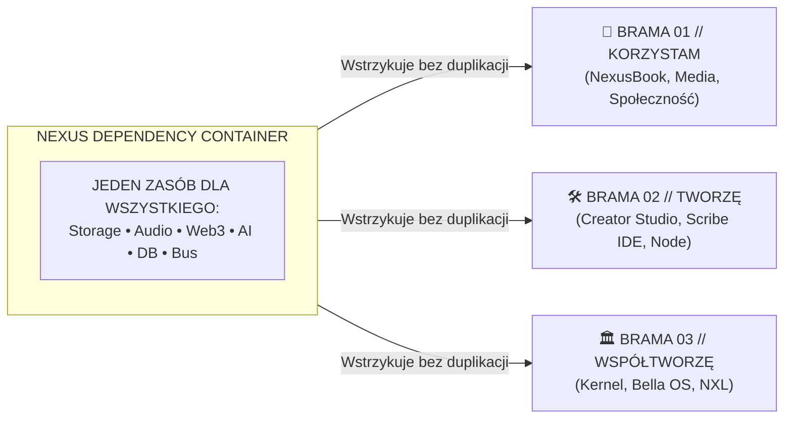

# NEXUS UNIVERSAL DEPENDENCY & CAPABILITY CONTAINER (NXL v1.0)

## 🏛️ Zasada Nadrzędna: Zero Duplikacji Zasobów

Zgodnie z poleceniem Architekta Systemu:
> **"Zbudowanie kontenera z zależnościami, które nie będą powielane dla każdego nowego modułu, a staną się jednym zasobem dla wszystkiego."**

W tradycyjnych architekturach każdy nowy moduł (np. *NexusBook*, *NexusMedia*, *Kaisa*, *Creator Studio*) instalował lub inicjalizował własne instancje:
- osobny `AudioContext` (powodujący zablokowanie kanałów dźwiękowych w przeglądarce),
- osobnego klienta Web3/Viem (generującego niepotrzebne zapytania RPC),
- osobną strukturę bazodanową IndexedDB,
- osobne połączenia i handlery AI (Gemini SDK),
- osobne kolejki synchronizacji chmurowej (Cloud SQL / Firestore).

W architekturze **Nexus Sovereign OS** wprowadzony został **Centralny Kontener Zależności (`NexusDependencyContainer`)**, który stanowi **jedyny współdzielony punkt dostępu do zasobów sprzętowych, sieciowych i logicznych**.

---

## 🧩 Moduł Kontenera: `src/core/dependency-container.ts`

### 1. Zarejestrowane Zasoby Współdzielone (Shared Resources)

| Zasób | Interfejs | Opis i Funkcja w Ekosystemie |
|---|---|---|
| **`storage`** | `NexusStorageResource` | Zunifikowana pamięć klucz-wartość (LocalStorage) + wysokopojemny magazyn binarny IndexedDB (`nexus_sovereign_db`) na książki, światy HTML, okładki i manuskrypty. |
| **`audio`** | `NexusAudioResource` | Pojedynczy nadrzędny Web Audio Synthesizer (`soundFx`) – procedury SFX, kliknięcia, sukcesy, dźwięki bram, synchronizacja wyciszenia i haptyki. |
| **`blockchain`** | `NexusBlockchainResource` | Singleton klienta `viem` (`PublicClient`) podłączony do sieci BNB Chain (Chain ID 56) – obsługa suwerennego dokowania portfela, odczyt stanu bloków i sald. |
| **`ai`** | `NexusAiResource` | Zintegrowany most Gemini 2.5 (`@google/genai`) z automatycznym awaryjnym trybem lokalnym offline przy braku klucza API. |
| **`database`** | `NexusDatabaseResource` | Hybrydowy zarządca synchronizacji Firestore + Cloud SQL (`nexussocial.pl`), z buforowaniem offline `nexus_offline_sync_queue`. |
| **`events`** | `typeof eventBus` | Centralna magistrala pub/sub (`eventBus`) do wymiany komunikatów między modułami w czasie rzeczywistym. |

---

## 🚀 Jak Moduły Korzystają z Kontenera?

### Sposób 1: React Hook (Wewnątrz Komponentów)
Każdy moduł (np. czytnik NexusBook, studio nagrań NexusMedia) uzyskuje natychmiastowy dostęp do zasobów:

```tsx
import { useNexusDependencies } from '../core/dependency-container';

export function MojeNoweStudio() {
  const { storage, audio, blockchain, ai } = useNexusDependencies();

  const handleAction = async () => {
    audio.playClick();
    await storage.setIndexedDbRecord('my_store', 'doc_1', { data: 'hello' });
    const text = await ai.generateText('Opisz świat Nexus');
  };

  return <button onClick={handleAction}>Wykonaj</button>;
}
```

### Sposób 2: Bezpośredni Import Singletonu (W Serwisach)
```ts
import { nexusContainer } from '../core/dependency-container';

const audio = nexusContainer.resolve('audio');
const storage = nexusContainer.resolve('storage');
```

### Sposób 3: Wewnątrz Piaskownic i Konsoli Deweloperskiej
Kontener jest automatycznie zamontowany w globalnym obiekcie przeglądarki:
```js
window.__NEXUS_DEPENDENCY_CONTAINER__
window.__NEXUS_CONTAINER__
```

---

## 🛡️ Odporność na Tryb Offline (Graceful Degradation)

- Brak sieci zewnętrznej **nie blokuje** uruchamiania NexusBooka ani innych modułów.
- Wszystkie połączenia asynchroniczne (`dockToNexus`, `initializeDatabaseConnection`) są nieblokujące.
- W przypadku braku odpowiedzi z sieci zewnętrznej system natychmiast korzysta z lokalnej pamięci podręcznej i predefiniowanego kanonu dzieł (`SAMPLE_BOOKS`, `presetHtmlWorlds.ts`).

---

## 🏛️ Podział na Trzy Bramy a Kontener Zależności



- **Brama 01 (Użytkownik)**: NexusBook Ledger otwiera się bezpośrednio w zakładce bez otwierania nowych okien czy modali.
- **Brama 02 (Twórca)**: Moduły uruchamiane w piaskownicy `NexusModuleShell` czerpią z tego samego zestawu zasobów.
- **Brama 03 (Rodzina)**: Architekci monitorują stan kontenera i telemetrię węzłów.
